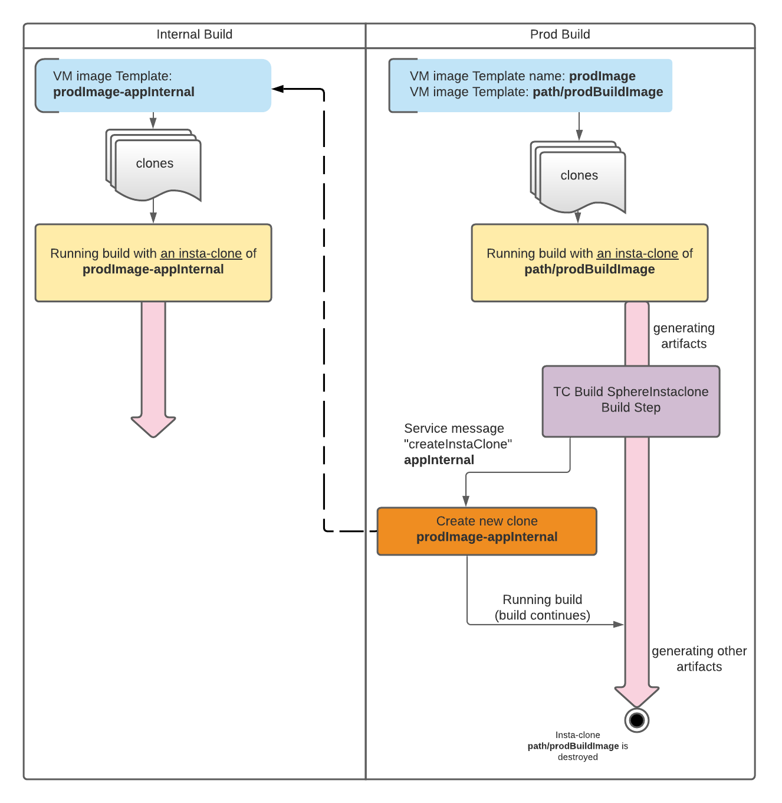
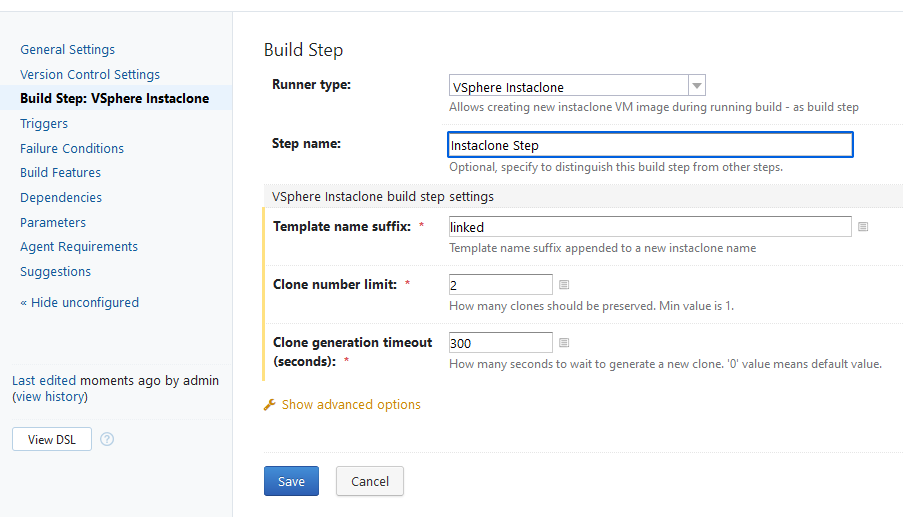
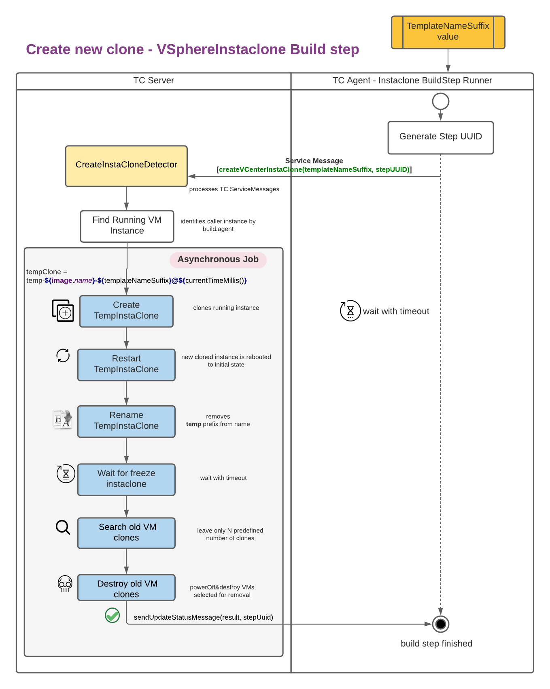

# vsphere-instaclone

Use VMware instant clone technology to spawn TeamCity cloud agent quickly.

## Content
[//]: https://imthenachoman.github.io/nGitHubTOC
[//]: https://ecotrust-canada.github.io/markdown-toc/

## Installation

1. Download the plugin .zip file from this [repo's releases](https://github.com/avast/vsphere-instaclone/releases).
2. Upload it to TeamCity (Administration -> Plugins list -> Upload plugin zip).

## Server Configuration

Create a new cloud profile in your project and set its type to vSphere Instaclone.
Fill in the path to the vSphere API, this is typically of the form "https://my.vsphere.host/sdk".
Note that if your company is too lazy to get the real certificate for that URL,
you'll need to install the appropriate certificate to cacerts store
of your TeamCity's JRE. I'm purposefully leaving out the detailed instructions
in the hopes that obtaining a trusted cert is easier.

Fill in username and password; the account must have sufficient privileges
to search for machines and perform the instant clone operation:

* System.View
* VirtualMachine.Provisioning.Clone
* VirtualMachine.Interact.PowerOn
* VirtualMachine.Inventory.CreateFromExisting
* Datastore.AllocateSpace
* Resource.AssignVMToPool

Finally, provide one or more image configurations.

    {
        "image-name": {
            "template": "datacenter/vm/tc-agent-template",
            "instanceFolder": "datacenter/vm/tc-agents",
            "maxInstances": 50,
            "agentPool": "mypool",
            "resourcePool": "myResourcePool",
            "datastore": "myDataStore",
            "network": "datacenter/network/agent-network"
        }
    }

For each image, `template` specifies the path to the virtual machine to clone.
On vSphere, this path always starts with the name of the datacenter, followed by "vm".

The key `instanceFolder` specifies the vSphere folder in which cloned machines should
be placed. This can be the folder your template resides in.
The name of the image is used as a base for the names of the cloned images.

The plugin will not allow more than `maxInstances` instances to run simultaneously.

If `agentPool` is unspecified, the image will be assigned to the default pool.
You can set an explicit pool by specifying either the pool's name or its
numeric identifier.

Optionally, you can set the network to which the cloned machine's ethernet card should
be connected. If your image contains multiple network cards, set this field to an
array of network names.

## Creating Agent Image

1. Prepare the machine to contain everything you need in your jobs.
2. Make sure VMware tools are installed.
3. Install the TeamCity agent and connect it to TeamCity.
4. *Let it upgrade*. This is very important, you don't want the agent upgrading post-clone.
   Also, this plugin must be installed on the server so that the agent can pick it up.
5. Once ready, modify the agent's `build.properties` file by
   * deleting the authentication token (this ensures that each clone gets a new one) and by
   * setting `vmware.freeze.script` to a path to your freeze script (see below).
   * Optionally, set `vmware.shutdown.script`.
6. Wait a little. The agent will pick up the changes and restart. Just before registering
   to your TeamCity server, the agent will execute the freeze script, which should freeze your VM.
   Once cloned, the freeze script continues executing on the new machine.

## Agent configuration

The agent needs access to `rpctool` from VMware tools.
Usually, the agent will find the tool automatically, unless it's installed in an unusual path.
In that case, set the `teamcity.vmware.rpctool.path` property in `build.properties`
to the path to the `rpctool` executable.

Setting `vmware.freeze.script` will cause the agent to execute it during the next agent startup.

## Freeze Script

The simplest freeze script only performs the freeze, but you probably also want
to restart networking, so as to have new clones pick up a new IP address.
On Windows, the script might be a .bat file and look like this.

    netsh interface set interface "Ethernet0" disable
    "c:\Program Files\VMware\VMware Tools\rpctool.exe" "instantclone.freeze"
    netsh interface set interface "Ethernet0" enable

Adjust for other systems and your requirements.

## Shutdown Script

If set, the shutdown script is run after the agent has unregistered
from the server, but before the machine is deleted.
This is an ideal place to release the machine's IP address, for example.

## REST API

### Profiles CRUD
This plugin extends TC REST API to be able to list, create, update, remove VSphere instaclone profiles. 
[The extended API is described using Swagger aka OpenAPI v3](/etc/api/webapi.yaml).

### VSphere Accounts 
Accounts are defined centrally and every cloud profile is linked with an account ID.    
To set up list of available accounts you need to use [REST API call - /app/vmic/accounts/](/etc/api/webapi.yaml).
Posted data are encrypted with a random unique AES key, and the key is encrypted with RSA public key.
The private key from the keypair is physically stored on the TC server to be able to decrypt accounts list when needed. The keys should be saved in the PEM format. 

Account id must be unique.

Cloud profile without proper defined account id is rejected.

#### Creating RSA Keypair using OpenSSL
```bash
# generate a private key with the correct length
openssl genrsa -out accounts-pk.pem 2048
```

```bash
# generate corresponding public key
openssl rsa -in accounts-pk.pem -pubout -out public-key.pem
```

#### Account Private key location
The key should be placed at one of this location (ordered by higher priority): 
- `accountsPkPath` parameter in the plugin descriptor `teamcity-plugin.xml` 
- TC property `teamcity.vsphereinstaclone.accountsPkPath`
- file `${userHome}/vsphereinstaclone/accounts-pk.pem`


## Extended UI
There is a new "flat" view for profiles used defined by this plugin - `http://<teamcityurl>/vmic.html`. 
It's necessary to set up TC `MANAGE_AGENT_CLOUDS` permission for user. 

## VSphere instaclone TC build step
In case you always start to build from the clean image it might get handy to create some middle state with created files/artifacts.
This plugin defines a new build step `VSphere Instaclone` and it triggers creating a new instaclone on top of the running build. The cloning operation is blocking, after that the build continues.  
This new generated image can be reused for another defined builds (typically internal builds only) to speed up building - e.g. testing.
It helps to speed up building while it preserves security of the build process.

### How does it work?
Consider 2 defined builds - one for internal builds and one for production environment. 
Production environment build always starts from the clean image environment, and it produces several artifacts during a build (e.g. linked libraries). When the artifacts are created a new clone is created (via the build step) and it can be reused for the internal build.  
Internal build always selects the latest "snapshot version" of the generated image for its run. 
The new name for a newly generated image is based on `image-name` configuration, and it is generated as follows:  

`<image-name>-<templateSuffix>@timestampMillis`

#### Example
*Given:*
 - `image-name` = `XXImage-NameXX`
 - `templateSuffix` = `linkedDone` 

where `templateSuffix` value is a configuration property for VSphere instaclone TC build step.

*Result:*  - `XXImage-NameXX-linkedDone@0123456789`   

The internal build `template` path name configuration has to end with `@` character. The image template is selected by the highest template timestamp. Also, the template image virtual machine must be in **freezed** status state. 

This image demonstrates the cloning process



#### Internal build definition example
```
  "my-internal-image-name": {
      "template": "datacenter/vm/XXImage-NameXX-linkedDone@",
      "instanceFolder": "datacenter/vm/tc-agents",
      ...  
  }
```

#### Technical details
The build step (the agent side) sends request via [TC Service message](https://www.jetbrains.com/help/teamcity/service-messages.html) to the TC server. This message event triggers cloning process, and it's launched asynchronously. 
The message has a following structure:
```
   ##teamcity[createVCenterInstaClone templateNameSuffix='<templateNameSuffix>' uuid='<uuid>' cloneNumberLimit='<cloneNumberLimit>']
```
where 
- `templateNameSuffix` is a template suffix for a new clone template name 
- `uuid` is a pseudo-random generated string to identify agent sender 
- `cloneNumberLimit` defines how many older clones should be preserved. Min value is 1 

The parameter values are taken from the TC Build Step definition:



When the cloning finishes TC server sends information back about cloning result (fail/success) to the agent responsible for triggering action. 
The cloning process consists of several steps and in the end the number of already existing clones is limited to defined number.



